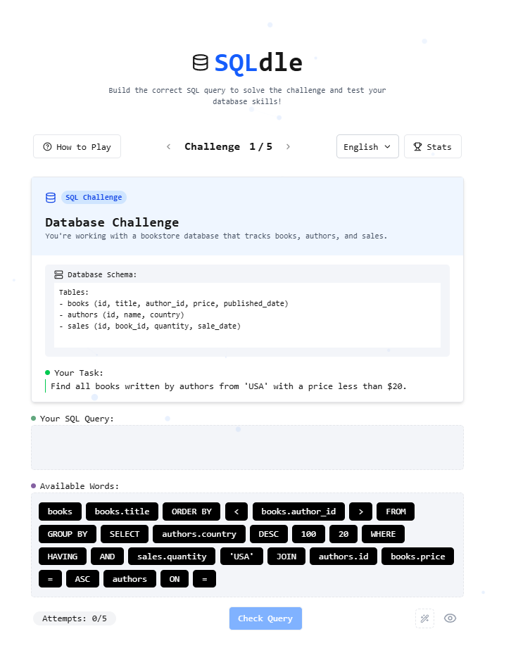

# SQLdle


🚀 **SQLdle** is a fun and interactive game that helps you practice and improve your SQL skills. Solve challenges by writing queries against a simulated bookstore database. Built with **Next.js**, it's designed to be fast, responsive, and engaging.

## 🌟 Features

- 🎯 A variety of SQL challenges to test your skills
- 🏗️ Drag-and-drop query builder for easy learning
- 🔄 Instant feedback on your queries
- 📊 Tracks your attempts and progress
- 🌍 Supports multiple languages

## 🛠 Tech Stack

- **Frontend:** Next.js, React
- **Backend:** (Coming soon)
- **Database:** (Coming soon)
- **Styling:** Tailwind CSS

## 🎮 How to Play

1. Read the challenge prompt.
2. Use the provided SQL keywords and clauses to build your query.
3. Click **Check Query** to see if it's correct.
4. Keep going and try to solve all the challenges!

## 📸 Screenshot



## 🚀 Getting Started

### Prerequisites

You'll need **Node.js** and **npm/yarn** installed.

### Installation

```sh
# Clone the repo
git clone https://github.com/yourusername/sql-dle.git
cd sql-dle

# Install dependencies
npm install  # or yarn install

# Run the development server
npm run dev  # or yarn dev
```

### Building for Production

```sh
npm run build  # or yarn build
npm start      # or yarn start
```

## 🌍 Deployment

You can deploy SQLdle easily on **Vercel**, **Netlify**, or **Heroku**.

```sh
# Deploy to Vercel
vercel
```

## 🤝 Contributing

Want to improve SQLdle? Fork the repo, create a new branch, and submit a pull request. Contributions are always welcome!

## 📜 License

This project is licensed under the **Creative Commons Attribution-NonCommercial-ShareAlike 4.0 International (CC BY-NC-SA 4.0)** License.

---

💡 **SQLdle** - Practice SQL while having fun!

